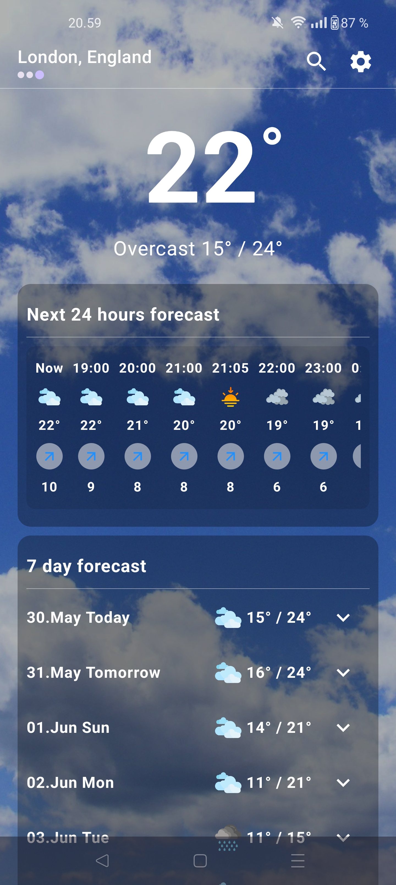
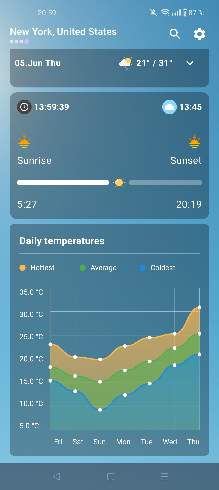
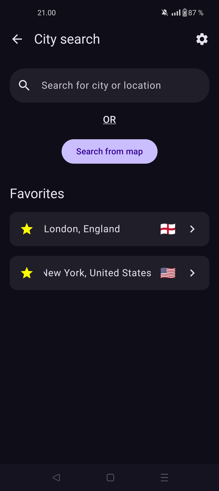
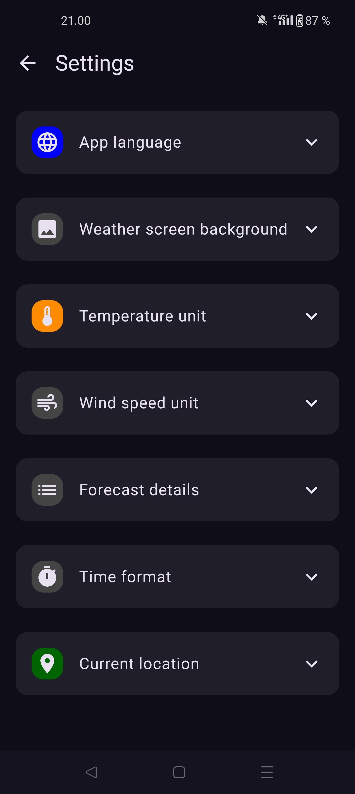

# ⛅ Weather App

> A modern, customizable weather app built with Jetpack Compose, offering real-time forecasts, location support, and offline usage

---

## 🧠 Table of Contents

- [About](#about)
- [Features](#features)
- [Screenshots](#screenshots)
- [Getting Started](#getting-started)
- [Usage](#usage)
- [Configuration](#configuration)
- [Tech Stack](#tech-stack)

---

## 📖 About

Weather App is a Jetpack Compose-based weather application that offers a smooth, customizable, and visually rich experience. Users can view weather forecasts based on their location or favorites, search globally, and customize settings like language, temperature units, and time format.

- Solves: Viewing weather in a quick, personalized way with offline and multi-location support.
- For: Users who want a clean, modern weather UI with useful statistics and customization as well as no ads or features behind paywall.

---

## ✨ Features

- ✅ Inspect weather data for any location
- ✅ Current weather and detailed hourly/daily forecasts
- ✅ GPS location support
- ✅ Favorite multiple locations and swipe between them
- ✅ Fully localized UI available in Finnish and English
- ✅ Dynamic backgrounds based on weather or user-selected preset
- ✅ World map-based location search
- ✅ Sunrise and sunset progress indicators
- ✅ Line chart for daily temperature changes
- ✅ Weather statistics including wind, precipitation, humidity, and more
- ✅ Manually configurable options for temperature units, wind speed, language and more
- ✅ Offline support for previously loaded locations
- ✅ Persistent settings and favorites stored to local storage

---

## 📸 Screenshots

<div align="center">
  
  
  
  
</div>

---

## 🚀 Getting Started

### Prerequisites

- Android Studio
- Android SDK 33 (Android 13)

### Installation

```bash
git clone https://github.com/simoalanne/WeatherApp
cd WeatherApp
# Open in Android Studio and sync Gradle
```

---

## ⚙️ Usage
To run the app:

- Open the project in Android Studio

- Launch the emulator or use your own android device

---

## 🛠 Configuration

No configuration required at this time

---

## 🧰 Tech Stack

- **Language**: Kotlin  

- **UI Framework**: Jetpack Compose

- **Networking**: Retrofit 

- **Async**: Kotlin Coroutines

- **Local Storage**: Room + DataStore

- **Location**: Fused Location Provider

- **Permissions**: Accompanist Permissions

- **Charts**: Compose Charts

- **Maps**: MapLibre Compose

- **Images**: Coil

- **Animations**: Lottie Compose  

---
